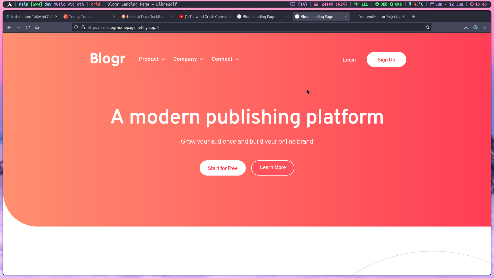

# Frontend Mentor - Blogr landing page solution

This is a solution to the [Blogr landing page challenge on Frontend Mentor](https://www.frontendmentor.io/challenges/blogr-landing-page-EX2RLAApP). Frontend Mentor challenges help you improve your coding skills by building realistic projects. 

## Table of contents

- [Overview](#overview)
  - [The challenge](#the-challenge)
  - [Screenshot](#screenshot)
  - [Links](#links)
- [My process](#my-process)
  - [Built with](#built-with)
  - [Continued development](#continued-development)
  - [Useful resources](#useful-resources)
- [Author](#author)

## Overview

### The challenge

Users should be able to:

- View the optimal layout for the site depending on their device's screen size
- See hover states for all interactive elements on the page

### Screenshot

### Links

- Solution URL: [Live Link](https://github.com/zelfroster/frontendMentorProjects/tree/master/Blogr-Landing-Page/blogr-landing-page-main)
- Live Site URL: [Add live site URL here](https://zel-blogrhomepage.netlify.app)

## My process

### Built with

- Semantic HTML5 markup
- CSS custom properties
- Flexbox
- Mobile-first workflow
- [TailwindCSS](https://tailwindcss.com) - CSS Framework

### Continued development

- Responsiveness is OK, but It just works, I will make it awesome as I develop my skills.

### Useful resources

- [TailwindCSS Docs](https://tailwindcss.com/docs/installation) - Docs were the most hepful resources for TailwindCSS.
- [Traversy Media (YT)](https://www.example.com) - This is an amazing Youtube Channel by Brad Traversy which helped me get started with TailwindCSS. I'd recommend it to anyone starting to learn this concept.

## Author

- Frontend Mentor - [@zelfroster](https://www.frontendmentor.io/profile/zelfroster)
- Twitter - [@zelfroster](https://www.twitter.com/zelfroster)
