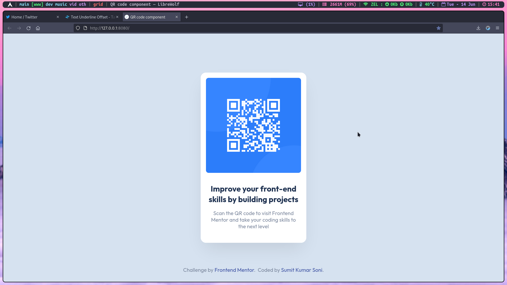

# Frontend Mentor - QR code component solution

This is a solution to the [QR code component challenge on Frontend Mentor](https://www.frontendmentor.io/challenges/qr-code-component-iux_sIO_H). Frontend Mentor challenges help you improve your coding skills by building realistic projects. 

## Table of contents

- [Overview](#overview)
  - [Screenshot](#screenshot)
  - [Links](#links)
- [My process](#my-process)
  - [Built with](#built-with)
  - [Useful resources](#useful-resources)
- [Author](#author)

## Overview

### Screenshot

### Links

- Solution URL: [Github repo](https://github.com/zelfroster/frontendMentorProjects/tree/master/QR-Component/qr-code-component-main)
- Live Site URL: [LIVE Link](https://zel-qrcomponent.netlify.app/)

## My process

### Built with

- Semantic HTML5 markup
- CSS custom properties
- Flexbox
- Mobile-first workflow
- [TailwindCSS](https://tailwindcss.com) - CSS framework

### Useful resources

- [TailwindCSS Docs](https://www.tailwindcss.com/docs) 

## Author

- Frontend Mentor - [@zelfroster](https://www.frontendmentor.io/profile/zelfroster)
- Twitter - [@zelfroster](https://www.twitter.com/zelfroster)
